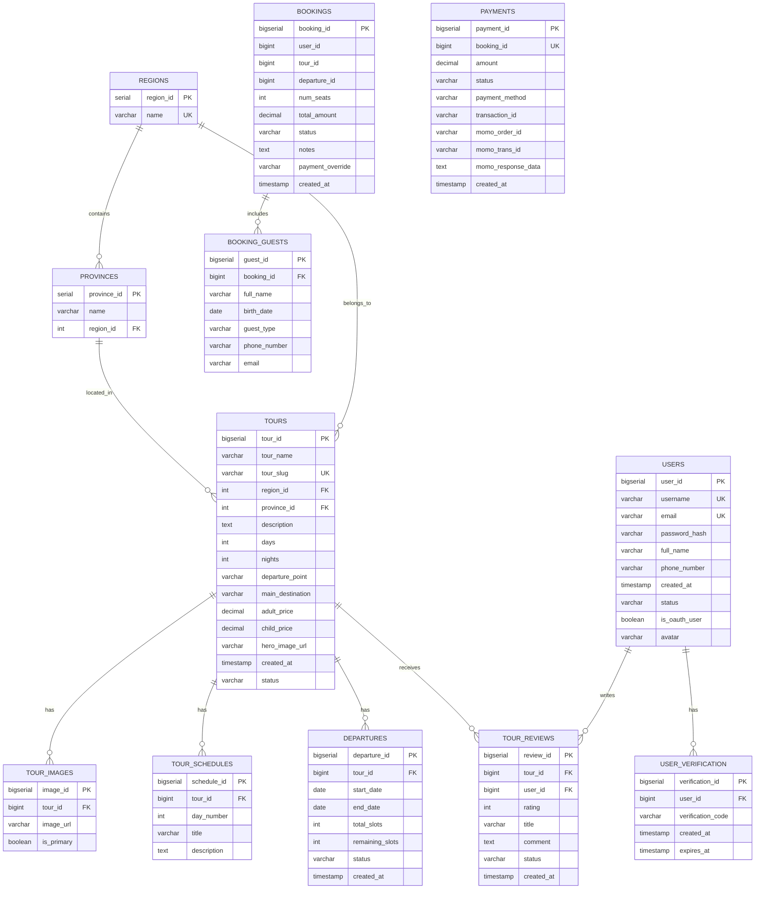

# BOOKINGTOUR - HỆ THỐNG ĐẶT TOUR DU LỊCH VIỆT NAM
## Kiến Trúc Microservices với Spring Boot & React

---

## 📋 MỤC LỤC

1. [Tổng Quan Hệ Thống](#1-tổng-quan-hệ-thống)
2. [Kiến Trúc Microservices](#2-kiến-trúc-microservices)
3. [Database Design](#3-database-design)
4. [API Documentation](#4-api-documentation)
5. [Luồng Nghiệp Vụ Chính](#5-luồng-nghiệp-vụ-chính)
6. [Frontend Architecture](#6-frontend-architecture)
7. [Tech Stack](#7-tech-stack)
8. [Demo & Screenshots](#8-demo--screenshots)
9. [Kết Luận](#9-kết-luận)

---

## 1. TỔNG QUAN HỆ THỐNG

### 🎯 Mục Tiêu Dự Án

BookingTour là hệ thống đặt tour du lịch trực tuyến cho thị trường Việt Nam với các tính năng:

- ✅ **Tìm kiếm & đặt tour** theo vùng miền, tỉnh thành
- ✅ **Thanh toán trực tuyến** qua MoMo Gateway
- ✅ **Quản lý booking** realtime với RabbitMQ
- ✅ **Đánh giá tour** với hệ thống kiểm duyệt
- ✅ **OAuth2** đăng nhập GitHub/Google
- ✅ **Admin dashboard** quản lý toàn diện
- ✅ **Email notifications** tự động

### 👥 Đối Tượng Sử Dụng

- **Khách hàng**: Tìm kiếm, đặt tour, thanh toán, đánh giá
- **Admin**: Quản lý tour, booking, review, users
- **System**: Xử lý thanh toán, gửi email, quản lý chỗ ngồi

---

## 2. KIẾN TRÚC MICROSERVICES

### 📐 System Architecture Diagram


### 🔧 Service Responsibilities

| Service | Port | Database | Responsibilities |
|---------|------|----------|------------------|
| **Eureka Server** | 8761 | - | Service discovery & registry |
| **API Gateway** | 8080 | - | Routing, CORS, Load balancing |
| **User Service** | 8081 | UserDB | Authentication, OAuth2, Email verification |
| **Tour Service** | 8082 | TourDB | Tours, Departures, Reviews, Images, Custom tours |
| **Booking Service** | 8083 | BookingDB | Reservations, Analytics, Export |
| **Payment Service** | 8084 | PaymentDB | MoMo payment, Refunds |

### 📬 RabbitMQ Event-Driven Architecture


---

## 3. DATABASE DESIGN

### 🗄️ Database Architecture



### 📊 Database Statistics

| Database | Tables | Key Entities | Indexes |
|----------|--------|--------------|---------|
| **UserDB** | 2 | Users, Verification | 3 |
| **TourDB** | 10 | Tours, Departures, Reviews | 15+ |
| **BookingDB** | 3 | Bookings, Guests, Logs | 8 |
| **PaymentDB** | 4 | Payments, Methods, Refunds | 6 |

### 🔑 Key Tables Schema

**TOURS Table:**
```sql
CREATE TABLE tours (
    tour_id         BIGSERIAL PRIMARY KEY,
    tour_name       VARCHAR(255) NOT NULL,
    tour_slug       VARCHAR(255) UNIQUE,
    region_id       INT NOT NULL REFERENCES regions(region_id),
    province_id     INT NOT NULL REFERENCES provinces(province_id),
    description     TEXT,
    days            INT,
    nights          INT,
    departure_point VARCHAR(255),
    main_destination VARCHAR(255),
    adult_price     DECIMAL(12,2),
    child_price     DECIMAL(12,2),
    hero_image_url  VARCHAR(500),
    created_at      TIMESTAMP DEFAULT CURRENT_TIMESTAMP,
    status          tour_status DEFAULT 'ACTIVE'
);
```

**BOOKINGS Table:**
```sql
CREATE TABLE bookings (
    booking_id       BIGSERIAL PRIMARY KEY,
    user_id          BIGINT NOT NULL,
    tour_id          BIGINT NOT NULL,
    departure_id     BIGINT NOT NULL,
    num_seats        INT NOT NULL CHECK (num_seats > 0),
    total_amount     DECIMAL(12,2) NOT NULL,
    status           booking_status DEFAULT 'PENDING',
    notes            TEXT,
    payment_override VARCHAR(50),
    created_at       TIMESTAMP DEFAULT CURRENT_TIMESTAMP,
    updated_at       TIMESTAMP DEFAULT CURRENT_TIMESTAMP
);

CREATE INDEX idx_bookings_user ON bookings(user_id);
CREATE INDEX idx_bookings_tour ON bookings(tour_id);
CREATE INDEX idx_bookings_departure ON bookings(departure_id);
CREATE INDEX idx_bookings_status ON bookings(status);
CREATE INDEX idx_bookings_created ON bookings(created_at DESC);
```

**PAYMENTS Table:**
```sql
CREATE TABLE payments (
    payment_id          BIGSERIAL PRIMARY KEY,
    booking_id          BIGINT UNIQUE NOT NULL,
    amount              DECIMAL(12,2) NOT NULL,
    status              payment_status DEFAULT 'PENDING',
    payment_method      VARCHAR(50),
    transaction_id      VARCHAR(255),
    momo_order_id       VARCHAR(255),
    momo_request_id     VARCHAR(255),
    momo_trans_id       VARCHAR(255),
    momo_payment_method VARCHAR(50),
    momo_response_data  TEXT,
    notes               TEXT,
    created_at          TIMESTAMP DEFAULT CURRENT_TIMESTAMP,
    updated_at          TIMESTAMP DEFAULT CURRENT_TIMESTAMP
);
```

---

## 4. API DOCUMENTATION

### 🌐 API Gateway Routing

**Base URL**: `http://localhost:8080/api`

```
┌─────────────────────────────────────────────────────┐
│              API GATEWAY (Port 8080)                │
├─────────────────────────────────────────────────────┤
│  /api/users/**        → User Service (8081)        │
│  /api/tours/**        → Tour Service (8082)        │
│  /api/reviews/**      → Tour Service (8082)        │
│  /api/bookings/**     → Booking Service (8083)     │
│  /api/dashboard/**    → Booking Service (8083)     │
│  /api/payments/**     → Payment Service (8084)     │
└─────────────────────────────────────────────────────┘
```

### 📡 Key API Endpoints

#### **User Service APIs**

```http
# Authentication
POST   /api/auth/register           # User registration
POST   /api/auth/login              # Login with JWT
POST   /api/auth/verify-email       # Email verification
GET    /api/auth/start-oauth/github # GitHub OAuth
GET    /api/auth/start-oauth/google # Google OAuth

# User Management
GET    /api/users                   # List all users (admin)
GET    /api/users/{id}              # Get user by ID
GET    /api/users/me                # Get current user profile
PUT    /api/users/profile           # Update profile
POST   /api/users/change-password   # Change password
```

#### **Tour Service APIs**

```http
# Tours
GET    /api/tours                   # List tours (filters: regionId, provinceId, keyword, status)
GET    /api/tours/{id}              # Get tour details
GET    /api/tours/by-slug/{slug}    # Get tour by slug
POST   /api/tours                   # Create tour (admin)
PUT    /api/tours/{id}              # Update tour (admin)
DELETE /api/tours/{id}              # Delete tour (admin)

# Departures
GET    /api/tours/{tourId}/departures              # List departures
GET    /api/tours/{tourId}/departures/availability # Check seats
POST   /api/tours/{tourId}/departures              # Add departure
PUT    /api/tours/{tourId}/departures/{id}         # Update departure
DELETE /api/tours/{tourId}/departures/{id}         # Delete departure

# Reviews
GET    /api/reviews/approved                # Public: all approved reviews
GET    /api/reviews/tours/{tourId}          # Public: tour reviews
GET    /api/reviews/tours/{tourId}/summary  # Review statistics
POST   /api/reviews/tours/{tourId}          # Create review
GET    /api/reviews/my-reviews              # User's reviews
GET    /api/reviews/admin                   # Admin: all reviews
PATCH  /api/reviews/admin/{id}/status       # Approve/Reject review

# Images
POST   /api/upload                          # Upload to Cloudinary
POST   /api/tours/{tourId}/images           # Add tour image
DELETE /api/tours/{tourId}/images/{id}      # Delete image
```

#### **Booking Service APIs**

```http
# Bookings
POST   /api/bookings                    # Create booking
GET    /api/bookings/{id}               # Get booking details
GET    /api/bookings/user/{userId}      # User's bookings (paginated)
GET    /api/bookings                    # All bookings (filters: status, tourId, departureId)
GET    /api/bookings/departure/{id}     # Departure bookings
DELETE /api/bookings/{id}               # Cancel booking
POST   /api/bookings/{id}/confirm       # Confirm booking (admin)

# Dashboard & Analytics
GET    /api/dashboard/stats             # Overall statistics
GET    /api/dashboard/revenue-trends    # Revenue chart data
GET    /api/dashboard/top-tours         # Top performing tours
GET    /api/dashboard/booking-status    # Status distribution

# Export
GET    /api/export/bookings/csv         # Export as CSV
GET    /api/export/bookings/excel       # Export as Excel
```

#### **Payment Service APIs**

```http
# Payment
POST   /api/payments/momo/orders           # Create MoMo payment
GET    /api/payments/booking/{bookingId}   # Get payment details
POST   /api/payments/booking/{id}/cancel   # Cancel payment

# Webhook (Internal)
POST   /api/payments/momo/webhook          # MoMo IPN callback
```

### 📤 Request/Response Examples

**Create Booking Request:**
```json
POST /api/bookings/bookings
Content-Type: application/json

{
  "userId": 1,
  "tourId": 1,
  "departureId": 1,
  "seats": 2,
  "totalAmount": 7780000,
  "guests": [
    {
      "fullName": "Nguyễn Văn A",
      "birthDate": "1990-01-15",
      "guestType": "ADULT",
      "phoneNumber": "0912345678",
      "email": "nguyenvana@example.com"
    },
    {
      "fullName": "Nguyễn Thị B",
      "birthDate": "1992-05-20",
      "guestType": "ADULT",
      "phoneNumber": "0987654321",
      "email": "nguyenthib@example.com"
    }
  ]
}
```

**Response:**
```json
{
  "bookingId": 1,
  "status": "PENDING",
  "message": "Booking created, processing seat reservation",
  "userId": 1,
  "tourId": 1,
  "departureId": 1,
  "seats": 2,
  "totalAmount": 7780000,
  "bookingDate": "2025-01-16T10:30:00"
}
```

**Create MoMo Payment Request:**
```json
POST /api/payments/momo/orders
Content-Type: application/json

{
  "bookingId": "1",
  "amount": 7780000,
  "userId": 1,
  "orderInfo": "Booking tour Ha Noi - Ha Long",
  "extraData": ""
}
```

**Response:**
```json
{
  "bookingId": "1",
  "orderId": "BT-1-1737012345678",
  "requestId": "1737012345678-abc123",
  "payUrl": "https://test-payment.momo.vn/v2/gateway/pay/...",
  "deeplink": "momo://app/...",
  "qrCodeUrl": "https://api.qrserver.com/v1/...",
  "resultCode": 0,
  "message": "Successful"
}
```

---

## 5. LUỒNG NGHIỆP VỤ CHÍNH

### 🎫 Booking Flow - Chi Tiết


### 💳 Payment Flow - MoMo Integration


### ⭐ Review Approval Workflow


### 🔐 Authentication Flow


---

## 6. FRONTEND ARCHITECTURE

### 🎨 Client App Structure

```
frontend/
├── src/
│   ├── components/
│   │   ├── layout/
│   │   │   ├── Header.jsx          # Navigation với auth state
│   │   │   ├── Footer.jsx
│   │   │   └── ProtectedRoute.jsx  # Route guard
│   │   ├── tour/
│   │   │   ├── TourCard.jsx        # Tour display card
│   │   │   ├── TourFilters.jsx     # Search & filter form
│   │   │   ├── TourGallery.jsx     # Image carousel
│   │   │   └── TourItinerary.jsx   # Schedule display
│   │   ├── booking/
│   │   │   ├── BookingForm.jsx     # Booking form with guests
│   │   │   └── BookingSummary.jsx  # Price calculation
│   │   └── reviews/
│   │       ├── ReviewList.jsx
│   │       └── ReviewForm.jsx
│   ├── pages/
│   │   ├── Home.jsx
│   │   ├── Tours.jsx               # Search & list
│   │   ├── TourDetail.jsx          # Tour details page
│   │   ├── BookingPage.jsx
│   │   ├── BookingHistory.jsx
│   │   ├── PaymentStatus.jsx       # MoMo redirect page
│   │   └── Reviews.jsx
│   ├── context/
│   │   └── AuthContext.jsx         # Global auth state
│   ├── services/
│   │   └── api.js                  # Axios API client
│   └── utils/
│       └── format.js               # Currency, date formatting
```

### 🖥️ Admin Dashboard Structure

```
frontend-admin/
├── src/
│   ├── components/
│   │   ├── layout/
│   │   │   ├── Sidebar.jsx         # Admin navigation
│   │   │   └── Header.jsx
│   │   ├── common/
│   │   │   ├── Table.jsx           # Reusable data table
│   │   │   ├── Card.jsx
│   │   │   ├── Button.jsx
│   │   │   └── StatusPill.jsx      # Status badges
│   │   ├── tours/
│   │   │   └── TourForm.jsx
│   │   ├── departures/
│   │   │   └── DepartureForm.jsx
│   │   └── bookings/
│   │       └── BookingTable.jsx
│   ├── pages/
│   │   ├── Dashboard.jsx           # Statistics & charts
│   │   ├── Tours/
│   │   │   ├── TourList.jsx
│   │   │   ├── TourCreate.jsx
│   │   │   └── TourEdit.jsx
│   │   ├── Departures/
│   │   │   ├── DepartureList.jsx
│   │   │   └── DepartureDetail.jsx
│   │   ├── Bookings/
│   │   │   ├── BookingList.jsx
│   │   │   └── BookingDetail.jsx
│   │   └── Reviews/
│   │       └── ReviewList.jsx
│   └── services/
│       └── api.js
```

### 📱 Key Frontend Features

**1. Tour Search & Filter**
```jsx
// Example: TourFilters.jsx
<TourFilters
  onFilter={(filters) => {
    // filters: { regionId, provinceId, priceRange, keyword }
    fetchTours(filters);
  }}
  regions={regions}
  provinces={provinces}
/>
```

**2. Booking Form với Guest Info**
```jsx
// Example: BookingForm.jsx
<form onSubmit={handleSubmit}>
  <DepartureSelector tourId={tourId} />
  <GuestInfoFields guests={guests} onChange={updateGuests} />
  <PriceCalculator
    adultPrice={tour.adultPrice}
    childPrice={tour.childPrice}
    guests={guests}
  />
  <button>Tiếp tục thanh toán</button>
</form>
```

**3. Review System**
```jsx
// Example: ReviewForm.jsx
<ReviewForm
  tourId={tourId}
  onSubmit={async (review) => {
    await reviewsAPI.create(tourId, review);
    toast.success('Đánh giá đã được gửi, chờ duyệt');
  }}
/>
```

---

## 7. TECH STACK

### 🛠️ Technology Overview


### 📦 Dependencies Summary

**Backend Core:**
```xml
<!-- Spring Boot -->
<parent>
    <groupId>org.springframework.boot</groupId>
    <artifactId>spring-boot-starter-parent</artifactId>
    <version>3.3.3</version>
</parent>

<!-- Spring Cloud -->
<dependency>
    <groupId>org.springframework.cloud</groupId>
    <artifactId>spring-cloud-dependencies</artifactId>
    <version>2023.0.3</version>
</dependency>

<!-- Database -->
<dependency>
    <groupId>org.springframework.boot</groupId>
    <artifactId>spring-boot-starter-data-jpa</artifactId>
</dependency>
<dependency>
    <groupId>org.postgresql</groupId>
    <artifactId>postgresql</artifactId>
</dependency>

<!-- Messaging -->
<dependency>
    <groupId>org.springframework.boot</groupId>
    <artifactId>spring-boot-starter-amqp</artifactId>
</dependency>

<!-- Security & JWT -->
<dependency>
    <groupId>io.jsonwebtoken</groupId>
    <artifactId>jjwt-api</artifactId>
    <version>0.12.3</version>
</dependency>
```

**Frontend Core:**
```json
{
  "dependencies": {
    "react": "^18.2.0",
    "react-dom": "^18.2.0",
    "react-router-dom": "^6.21.3",
    "vite": "^5.0.10",
    "tailwindcss": "^3.4.1",
    "framer-motion": "^12.23.24",
    "lucide-react": "^0.424.0",
    "react-hook-form": "^7.65.0",
    "axios": "^1.6.5"
  }
}
```

---

## 8. DEMO & SCREENSHOTS

### 🖼️ Screenshot Placeholders

> **Lưu ý**: Thêm screenshots thực tế vào các vị trí sau

#### **Client App Screenshots**

**1. Homepage**
```
[SCREENSHOT: Homepage với hero banner, search bar, featured tours]
- Hero section với background image
- Search form (destination, dates, guests)
- Featured tours carousel
- Customer testimonials
```

**2. Tour Search & Listing**
```
[SCREENSHOT: Tours page với filters sidebar]
- Left sidebar: Filters (region, province, price range)
- Tour grid: Cards with images, title, price, rating
- Pagination controls
```

**3. Tour Detail Page**
```
[SCREENSHOT: Tour detail với gallery, itinerary, reviews]
- Image gallery carousel
- Tour information (duration, departure point, price)
- Daily itinerary tabs
- Departure calendar
- Review section với rating stars
- "Đặt ngay" button
```

**4. Booking Form**
```
[SCREENSHOT: Booking page với guest information form]
- Selected tour summary
- Departure date picker
- Guest information fields (name, DOB, type, contact)
- Add/remove guest buttons
- Price breakdown
- Terms & conditions checkbox
- "Thanh toán" button
```

**5. Payment Page**
```
[SCREENSHOT: MoMo payment page hoặc deeplink]
- MoMo logo
- Order information
- QR code hoặc app button
- Payment amount
- Countdown timer
```

**6. Booking History**
```
[SCREENSHOT: User's booking list]
- Booking cards với status badges (Pending, Confirmed, Cancelled)
- Tour thumbnail, name, dates
- Total amount, seats
- Action buttons (View, Cancel)
```

**7. Review Submission**
```
[SCREENSHOT: Submit review modal/page]
- Star rating selector (1-5 stars)
- Title input
- Comment textarea
- Submit button
```

#### **Admin Dashboard Screenshots**

**8. Dashboard - Statistics**
```
[SCREENSHOT: Admin dashboard với charts]
- KPI cards (Total Bookings, Revenue, Active Tours, Users)
- Revenue trends line chart (Recharts)
- Booking status pie chart
- Top tours table
- Recent bookings list
```

**9. Tour Management**
```
[SCREENSHOT: Tour list table]
- Data table với columns (ID, Name, Region, Status, Actions)
- Filter dropdowns (Region, Province, Status)
- "Thêm mới" button
- Edit/Delete actions
```

**10. Departure Management**
```
[SCREENSHOT: Departure form]
- Tour selector
- Start/End date pickers
- Total slots input
- Remaining slots (auto-calculated)
- Status dropdown
- Save/Cancel buttons
```

**11. Booking Management**
```
[SCREENSHOT: Booking list với payment status]
- Booking table với columns (ID, User, Tour, Date, Amount, Payment, Booking Status)
- Payment status badges (PENDING, PROCESSING, COMPLETED)
- "Xác nhận" button for PENDING + COMPLETED payments
- Filter by departure, status
- Export buttons (CSV, Excel)
```

**12. Review Moderation**
```
[SCREENSHOT: Review approval interface]
- Review cards với rating, title, comment
- User info, tour name
- Timestamp
- Approve/Reject buttons
- Filter by status (PENDING, APPROVED, REJECTED)
```

### 🎬 Demo Scenarios

**Scenario 1: Complete Booking Flow**
```
1. User browses homepage
2. Searches for "Hạ Long" tours
3. Selects "Hà Nội - Hạ Long 3N2Đ"
4. Views tour details, reads reviews
5. Clicks "Đặt ngay"
6. Fills guest information (2 adults)
7. Clicks "Thanh toán"
8. Redirected to MoMo
9. Completes payment
10. Receives confirmation email
11. Views booking in history
```

**Scenario 2: Admin Workflow**
```
1. Admin logs in to dashboard
2. Views statistics (bookings, revenue)
3. Creates new departure for tour
4. Checks pending reviews
5. Approves 3 reviews, rejects 1
6. Views booking list
7. Confirms booking with COMPLETED payment
8. Exports bookings to Excel
```

**Scenario 3: Review Submission**
```
1. User views completed booking
2. Clicks "Viết đánh giá"
3. Rates 5 stars
4. Writes comment about experience
5. Submits review (status: PENDING)
6. Admin sees in pending list
7. Admin approves review
8. Review appears on tour page
```

---

## 9. KẾT LUẬN

### ✨ Key Achievements

✅ **Kiến trúc Microservices hoàn chỉnh**
- Service discovery với Eureka
- API Gateway routing
- Event-driven với RabbitMQ
- Database isolation

✅ **Tính năng đầy đủ**
- Tour booking workflow
- MoMo payment integration
- Review & rating system
- OAuth2 authentication
- Email notifications
- Admin dashboard với analytics

✅ **Tech Stack hiện đại**
- Spring Boot 3.3.3 (Java 17)
- React 18 + Vite
- PostgreSQL 15
- RabbitMQ messaging
- Docker containerization

✅ **Best Practices**
- Separation of concerns
- Event-driven architecture
- Database indexing
- Error handling & logging
- Security (JWT, OAuth2, signature verification)

### 🚀 Future Enhancements

**Phase 1 - Security & Performance:**
- [ ] Implement JWT validation in API Gateway
- [ ] Add role-based authorization (RBAC)
- [ ] Redis caching layer
- [ ] Rate limiting & throttling
- [ ] Distributed tracing (Zipkin/Sleuth)

**Phase 2 - Features:**
- [ ] Refund workflow automation
- [ ] Multi-currency support
- [ ] Real-time notifications (WebSocket)
- [ ] Tour recommendation engine
- [ ] Mobile app (React Native)

**Phase 3 - DevOps:**
- [ ] Kubernetes deployment
- [ ] CI/CD pipeline (Jenkins/GitHub Actions)
- [ ] Centralized logging (ELK Stack)
- [ ] Monitoring (Prometheus + Grafana)
- [ ] Auto-scaling configuration

### 📊 System Metrics

| Metric | Value |
|--------|-------|
| **Microservices** | 6 services |
| **Databases** | 4 PostgreSQL instances |
| **API Endpoints** | 60+ endpoints |
| **RabbitMQ Queues** | 7 queues |
| **Frontend Pages** | 25+ pages (client + admin) |
| **Tables** | 25+ tables |
| **Lines of Code** | ~15,000 LOC (backend + frontend) |

### 🎓 Learning Outcomes

**Technical Skills:**
- Microservices architecture design
- Event-driven messaging patterns
- Payment gateway integration
- OAuth2 authentication flow
- Database schema design
- RESTful API development
- Modern React development

**Tools & Technologies:**
- Spring Boot ecosystem
- Docker containerization
- RabbitMQ messaging
- PostgreSQL database
- React + Vite frontend
- MoMo payment API

### 📞 Contact & Resources

**Documentation:**
- API Docs: `http://localhost:8080/api/docs` (future)
- Eureka Dashboard: `http://localhost:8761`
- RabbitMQ Management: `http://localhost:15672` (guest/guest)

**Repositories:**
- Backend: `/microservices/*-service`
- Frontend Client: `/frontend`
- Frontend Admin: `/frontend-admin`
- Database Scripts: `/sql-scripts`

**Team:**
- [Tên team member]
- [Email/GitHub]

---

## APPENDIX

### A. Environment Setup

**Prerequisites:**
```bash
- Java 17+
- Node.js 18+
- Docker Desktop
- Maven 3.6+
```

**Quick Start:**
```bash
# 1. Clone repository
git clone <repository-url>

# 2. Start infrastructure
docker-compose up -d postgres-db booking-db payment-db rabbitmq

# 3. Initialize databases
docker exec -i postgres-db psql -U postgres < sql-scripts/init-databases.sql
docker exec -i booking-db psql -U postgres < sql-scripts/init-booking-db.sql
docker exec -i payment-db psql -U postgres < sql-scripts/init-payment-db.sql

# 4. Start services
cd eureka-server && mvn spring-boot:run &
cd api-gateway && mvn spring-boot:run &
cd user-service && mvn spring-boot:run &
cd tour-service && mvn spring-boot:run &
cd booking-service && mvn spring-boot:run &
cd payment-service && mvn spring-boot:run &

# 5. Start frontends
cd frontend && npm install && npm run dev &
cd frontend-admin && npm install && npm run dev &
```

### B. MoMo Integration Details

**Test Credentials:**
```
Partner Code: MOMOBKUN20180529
Access Key: klm05TvNBzhg7h7j
Secret Key: at67qH6mk8w5Y1nAyMoYKMWACiEi2bsa
```

**Endpoints:**
```
Test: https://test-payment.momo.vn/v2/gateway/api/create
Prod: https://payment.momo.vn/v2/gateway/api/create
```

**Signature Algorithm:**
```java
rawSignature = "accessKey=" + accessKey
    + "&amount=" + amount
    + "&extraData=" + extraData
    + "&ipnUrl=" + ipnUrl
    + "&orderId=" + orderId
    + "&orderInfo=" + orderInfo
    + "&partnerCode=" + partnerCode
    + "&redirectUrl=" + redirectUrl
    + "&requestId=" + requestId
    + "&requestType=" + requestType;

signature = HMAC_SHA256(rawSignature, secretKey);
```

### C. RabbitMQ Configuration

**Exchanges:**
- `payment.exchange` (Direct)
- `booking.events` (Topic)
- `tour.events` (Topic)
- `email.exchange` (Direct)

**Key Bindings:**
```
payment.charge.queue → payment.exchange [payment.charge]
payment.events.queue → payment.exchange [payment.completed, payment.failed]
tour.seat.reserved.queue → tour.events [tour.seat.reserved]
tour.seat.failed.queue → tour.events [tour.seat.reservationFailed]
email.booking.confirmed.queue → email.exchange [email.booking.confirmed]
```

### D. Database Connection Strings

```properties
# UserDB & TourDB
spring.datasource.url=jdbc:postgresql://localhost:5432/tour_management
spring.datasource.username=postgres
spring.datasource.password=postgres

# BookingDB
spring.datasource.url=jdbc:postgresql://localhost:5433/bookingdb
spring.datasource.username=postgres
spring.datasource.password=postgres

# PaymentDB
spring.datasource.url=jdbc:postgresql://localhost:5434/paymentdb
spring.datasource.username=postgres
spring.datasource.password=postgres
```

---

**END OF PRESENTATION**

---

*Generated for BookingTour Project*
*Last Updated: January 2025*
*Version: 1.0*
